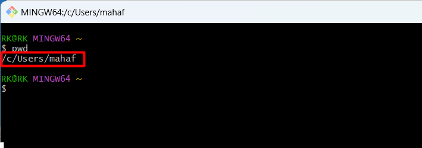
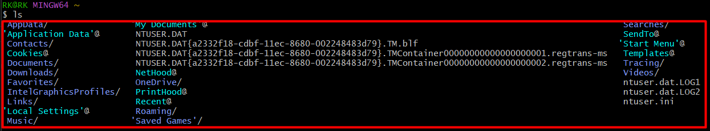
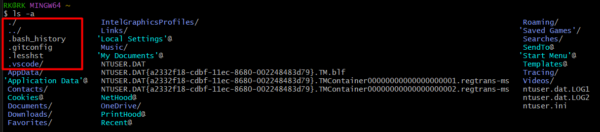
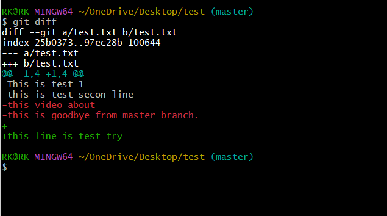
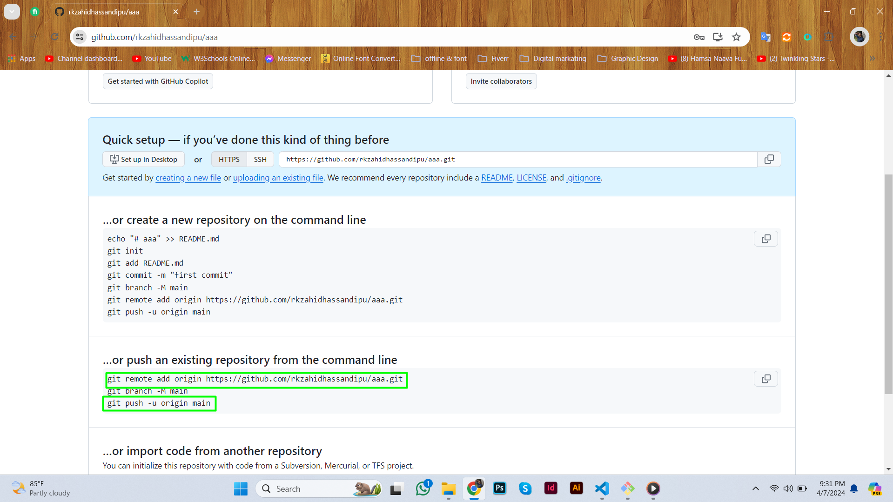
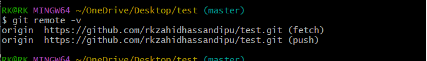
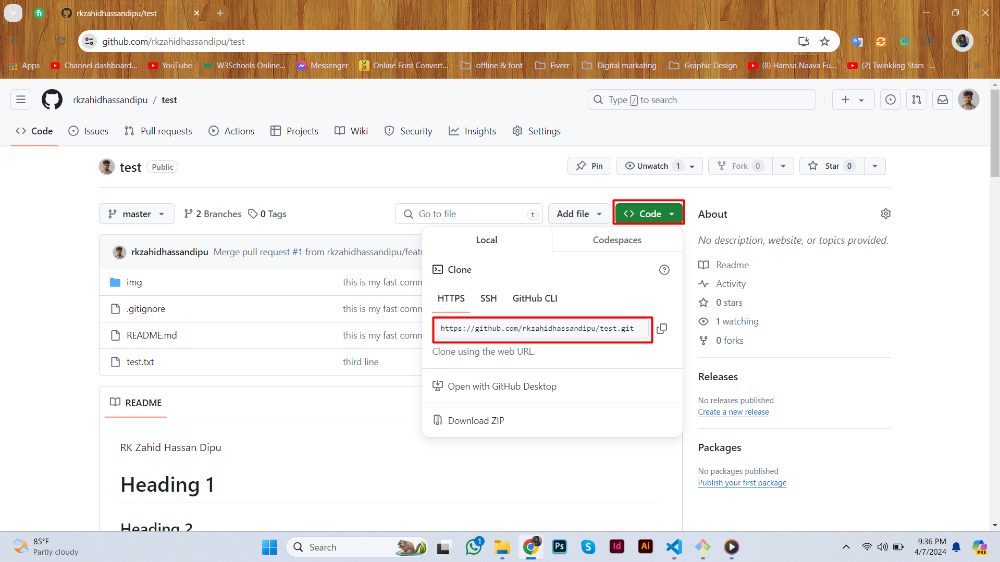

1. Git version চেক করার জন্য = git --version

2. Git user name/Email set করার জন্য
    git config --global user.name 'name here' /user.email 'email  here'
    User Name/Email চেক করার জন্য git config --list
    User Name/Email যে কোনো একটা দেখার জন্য git config user.name/user.name

3. অনেক লিখা হয়ে গিলে control+l

4. যে folder এ আছি সেটা দেখার জন্য = pwd - এটা একটা লিঙ্ক আকারে দেখাবে
    

5. যদি সব folder দেখতে চাই তাহলে = ls  এবং hide file দেখার জন্য = ls -a
    
    

6. কিভাবে folder থেকে বের হব = cd .. এবং cd folder name dile প্রবেশ করবে

7. folder তৈরি করার জন্য = mkdir folder name

8. folder এর ভিতর git install করার জন্য = git init
    git install চেক করার জন্য hide file দেখার জন্য = ls -a

9. File তৈরি করার জন্য touch  file name

9. সব file track করার জন্য git add . এবং একটা file track করার জন্য git add file name 

 Git untracked / track চেক করার জন্য git status

11. File untrack করার জন্য git rm -- cached file name

12. ফাইল থেকে কি সরানো হয়েছে তার পরিবর্তন দেখার জন্য git diff
    
13. File open করার জন্য explorer.exe file name

16. recent Commit remove করার জন্য git reset --soft HEAD^ uncommit হবে এবং untrack হবে

17. folder delet করার জন্য rm -rf folder name

18. resent commit delet করার জন্য = git reset --hard HEAD^ 

19. commit করার জন্য git commit -m "-----"
    Commit এবং track করার জন্য git commit -am "-----"
    
21.  সব চেক করার জন্য git log
     short commit দেখার জন্য git log --oneline
     শুধু একটা commit details দেখার জন্য git show id number

24.  একটা commit থেকে আর একটা commit এ যেতে git checkout id number 

25.  সব commit ফিরিয়ে আনার জন্য git checkout master

26.  কিভাবে ফাইল আপলোড করতে হয় github প্রথম ফোল্ডারে git install করতে হবে তার পরে git add যদি চাও তাহলে git commit  করতে পারো। এবং একটি github repository তৈরি করতে হবে তৈরি করার সময় or push existing লেখা দেখাবে এর নিচে থেকে fast line এবং last line নিতে হবে git remote add (default name  origin আমিও একটা নাম দিতে পারবো) fast-line git push -u (default name  origin আমিও একটা নাম দিতে পারবো)last name

27.  Remote repository চেক করার জন্য git remot  -v
    
28.  Git connection করার জন্য github থেকে code green button থেকে একটা link নিতে হবে git remote add (default name  origin আমিও একটা নাম দিতে পারবো)link
    
29.  যদি github এ আগে  কিছু পরিবর্তন থাকে সেটা computer a pull  করে আনতে হবে তার পরে আমি যেটা add করতে চাচ্ছি সেটা add করতে হবে github এ add করার জন্য git push -u name github থেকে  update আনার জন্য git pullকরতে হবে 

30.  কয়টা branch আছে তা দেখার জন্য git branch

31.  Branch তৈরি  করার জন্য git branch name

32.  একটা branch থেকে আর একটা branch move  করার জন্য git checkout branch name

33.  Branch delet করার জন্য git branch -d name

34.  Local branch এ কিছু add করতে চাইলে git merge branch name

35.  যখন master branch এবং other branch একটা লাইনে কাজ করা হবে তখন যে কোনো একটা branch এর কাজ delet করতে হবে যেমন other branch টা selet করে explorer.exe file name দিয়ে open করতে হবে তারপরে যে কোনো একটি branch এর কাজ delet করতে হবে